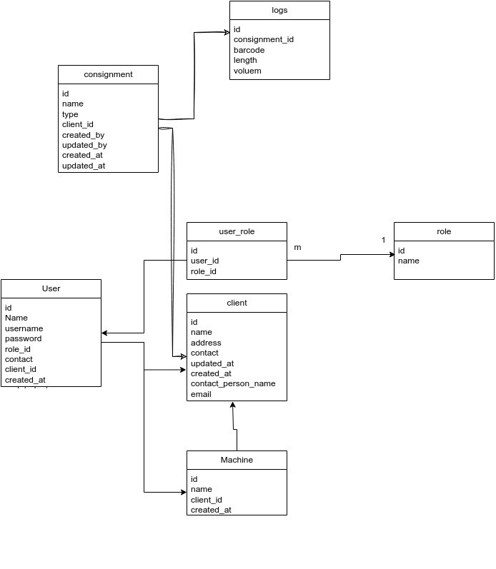
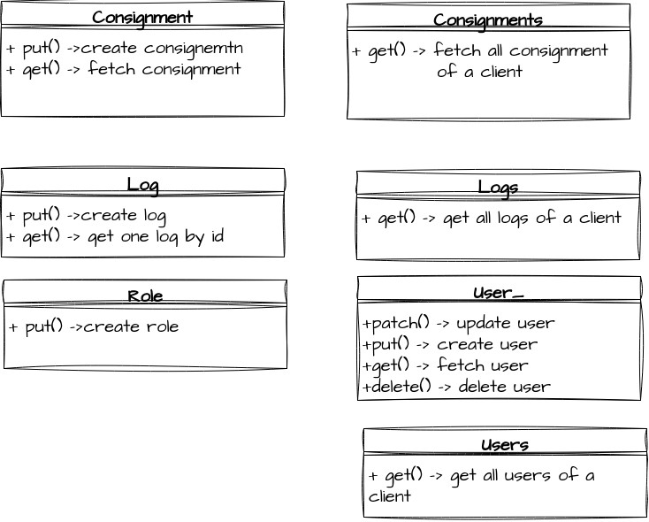
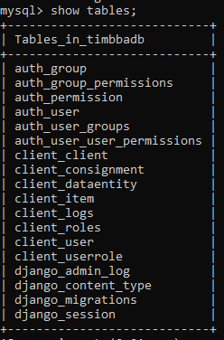

# web_dev_python


This is a web application developed using the Django framework. I have used the MySQL database. I have explained all the routes. To handle requests concurrently i have used the Gunicorn server.

## Client 
Our application operates on a subscription-based model, which means clients pay a periodic fee to access its features and services. One of the key features of our application is the ability for clients to create and manage multiple user accounts under a single subscription. This flexibility allows organizations and teams to efficiently use our application. The below section explains all routes for the client.

 - Create new Client

 - URL: timbba/client

 - HTTP Method: put()
```
Request Parameters:{
        "name":"vikesh",
        "address":"e 29 harkesh nagar",
        "contact": 81762110399,
        "email": "vk0015262@gmail.com"
    }

Response:{
        "message": "Client created successfully",
        "data": {
            "id": 4,
            "name": "vikesh",
            "address": "e 29 harkesh nagar",
            "contact": 81762110399,
            "updated_at": "2023-10-15T02:13:25.795Z",
            "created_at": "2023-10-15T02:13:25.795Z",
            "email": "vk0015262@gmail.com"
        }
    }

```

   
## User
The below routes help our client to manage their user, like seeing a list of users, adding a new user, updating a existing user, and deleting a user.

- Get information of a user by user_id.
- URL: timbba/user
- HTTP Method: get()

```
Request Parameters: {
    "id": 3
    }

Response : {
    "id": 3,
    "name": "vikesh",
    "username": "vk",
    "role_id": 1,
    "contact": " vikesh",
    "client_id": 1,
    "created_at": "2023-10-08T12:38:27.453Z",
    "updated_at": "2023-10-08T12:38:27.453Z"
    }
```

- Create a user. Or insert information of user in database.
- URL: timbba/user
- HTTP Method: put()

```
Request Parameters:{
        "client_id":1,
        "name": "vikesh",
        "address": "delhi",
        "role": 1,  
        "username": "vk",
        "contact": " vikesh"
}

Response{    
    "message": "User created successfully",
    "data": {
        "id": 3,
        "name": "vikesh",
        "username": "vk",
        "role_id": 1,
        "contact": " vikesh",
        "client_id": 1,
        "created_at": "2023-10-08T12:38:27.453Z",
        "updated_at": "2023-10-08T12:38:27.453Z"
    }
}
```
- Update user information by user_ id.
- URL: timbba/user
- HTTP Method: patch()
```
Request Parameter: {
        "id":2,
        "name": "vikash",
        "address": "noida",
        "role": 1,  
        "username": "vk1",
        "contact": " vikesh"    
    }

Response: {
        "message": "User updated successfully"
    }
```
- Delete user from the database by user_id.
- URL: timbba/user
- HTTP Method: delete()
 
```
    Request parameter:{
            "id":2 
        }

    Response: {
    "message": "User deleted successfully
    }
```
   
## Users

Below route help our client to fetch information about their all users

- get all users of a client
- URL: timbba/usres
- HTTP Method: get()

```
Request Parameters: {
    client_id: 3
    }    

Response : [
    {
        "id": 4,
        "name": "gobinda",
        "username": "gobind@128883",
        "role_id": 1,
        "contact": "12345890",
        "client_id": 3,
        "created_at": "2023-10-15T02:55:45.207Z",
        "updated_at": "2023-10-15T02:55:45.207Z"
    }
]
```
    
  
## Role
Each user will have one or more roles in our application. For example, a user can access an application using mobile only, another user can access using the web only and someone will have access to both. Some features in the mobile app are not available in the web app and vice versa.

- Create a new role.
- URL: timbba/role
- HTTP Method: put()

```
Request Parameters: {
    "name": "web"
}

Response:{
    "message": "Role created successfully",
    "data": {
        "id": 2,
        "name": "web"
    }
}
```

## Log

Each consignment will have a list of logs. We can fetch or put one log at a time in the database of a particular consignment.
Below routes helps our client to insert and fetch the log of a consignment.

- Insert information of a log in database
- URL: timbba/log
- HTTP Method:put() 

```
Request Parameters: {
    "barcode": "151ddf44",
    "length": 2,
    "volume":1,
    "con_id":4,
    "client_id": 2
}

Response: {
    "message": "log inserted successfully",
    "data": {
        "consignment_id": 4,
        "barcode": "151ddf44",
        "length": 2,
        "volume": 1
    }
}
```
- Fetch information of a log.
- URL: timbba/log
- HTTP Method: get()
```
Request Parameters: {
    "con_id":4,
    "client_id": 2
    "barcode": "151ddf44"
}

Response:{
    "id": 1,
    "barcode": "151ddf44",
    "length": 2,
    "volume":1,
    "con_id":4,
    "client_id": 2
}
```    

## Logs  
Each consignment has more than one log. The below route helps our client to see all the log information of a particular consignment.

- Fetch information of all logs of a consignment
- URL: timbba/logs
- HTTP Methods:get()
```
Request Parameters: {
        "con_id":4
        }

Response:{
    [
        {
            "consignment_id": 4,
            "barcode": "151ddf44",
            "length": "2.00",
            "volume": "1.00"
        }
    ]
}
```

## Consignment
Insert information of new consignment, or fetch information of existing consignment 

- create a consignment .insert information of a consignment of a client . It stores client_id because each consignment belongs to a client. It also stores user_id by which this consignment is created.
- URL: timbba/consignment
- HTTP Methods:put()

```
Request Parameters: {
    "name": "cons1111",
    "type": 0,
    "client_id": 2,
    "user_id": 4
}

Response : {
    "message": "Consignment created successfully",
    "data": {
        "id": 5,
        "name": "cons1111",
        "type": 0,
        "client_id": 2,
        "created_by": 4,
        "updated_by": 4,
        "created_at": "2023-10-15T04:03:59.339Z",
        "updated_at": "2023-10-15T04:03:59.339Z"
    }
}

```
- get information of a consignment by consignment_id.
- URL: timbba/consignment
- HTTP Method:get()

```
Request Parameters: {
    "con_id":5
}

Response :{
    "id": 5,
    "name": "cons1111",
    "type": "0",
    "client_id": 2,
    "created_by": 4,
    "updated_by": 4,
    "created_at": "2023-10-15T04:03:59.339Z",
    "updated_at": "2023-10-15T04:03:59.339Z"
}
    
```    
## Consignments

- get all consignments of a particular client by client_id 
- URL: timbba/consignments
- HTTP Method: get() 
```
Request Parameters: {
        "client_id" 1
    }

Response :
[
        {
        "id": 1,
        "name": "cons11",
        "type": "0",
        "client_id": 2,
        "created_by": 2,
        "updated_by": 2,
        "created_at": "2023-10-07T12:15:14.713Z",
        "updated_at": "2023-10-07T12:15:14.714Z"
        }
    ]
```


## Tools

### Docker:
 I have used two services: backend_service and mysql_service. backend_service containerizes my web application and mysql_service containerizes MySQL database.


### Gunicorn: 
I have used Gunicorn in this project to handle multiple HTTP requests at the same time.Gunicorn's worker process model is a way to handle multiple requests concurrently. Each worker process can handle multiple requests at a time.all of the worker processes are created before the application starts, and they remain running until the application is stopped.When a request comes in, Gunicorn assigns it to a worker process, The worker process then handles the request and returns the response. Once the request is complete, the worker process is ready to handle another request.Gunicorn can handle multiple requests concurrently because it uses a non-blocking I/O model. This means that the worker process does not wait for a request to complete before it starts handling the next request. Instead, the worker process will handle multiple requests at the same time, switching between them as needed.if a worker process gets down a new process will be created and all the old HTTP requests will be shifted to new process.


## How to run project

1. Open the Docker application in your system.

2. In the terminal run 'command Docker compose up'.

3. Above command build container. Then run 'docker exec -it container_name /bin/bash' to access the project running in docker

4.  Run the command 'python manage.py migrate' to generate tables in the database.

5.  Now you can see your tables using the command 'docker exec -it MySQL-container MySQL -u your_username -p'

6.  Enter your MySQL password.

7.  Run command 'SHOW DATABASES;'' to see your databse is created or not.

8.  run the command 'show tables;' to see all tables in your database .


## How did i connect this project to Gunicorn and Docker

### Step1:

created a gunicorn_config.py file.In gunicorn_config.py file i mentioned number of workers i need for my project. And mention the  port on which my server will listen for requests .

### Step2
Created a Dockerfile where i have mentioned 
- docer image of python
- specified Django's project setting file
- mentioned working directory as a app. inside container my project will be inside app directory.
- Then copy everything inside the app directory
- Then run requirement.txt file 
- Then run install Gunicorn
- then run Gunicorn and with gunicorn_config.py All above i have mentioned using the command in Dockerfile.

### Step3
Created docker-compose.yml file in which i specified two services one for backend and onother for MySQL.
I used MySQL image for MySQL server. In MySQL service i mentioned mySQL database name and MySQL password.


## Database Design
<<<<<<< HEAD
<<<<<<< Updated upstream
=======
=======
>>>>>>> 1b91e3442f5b33c769760ce1482c73c4b64858ab
- Client is company that uses our application.Client table stores information of a company. Client can have many users. A consignment always belongs to a client

- A consignment belongs to only one client.A consignment contains many logs.

- Log table stores information of log their dimensions like length,breadth,height.A log can belongs to only one consignment.

- User table stores information of a user like thier roles, client they belongs to ,name etc. A user can have many roles. And a user belongs to only one client.

<<<<<<< Updated upstream
<<<<<<< HEAD
-  user_role table store information of user's roles.one user can have multiple roles.
>>>>>>> Stashed changes
=======
-  user_role table store information of user's roles.one user can have multiple roles
>>>>>>> 1b91e3442f5b33c769760ce1482c73c4b64858ab
=======
-  user_role table store information of user's roles.one user can have multiple roles.
>>>>>>> Stashed changes



## Class Diagram 
- Consignment class has two method put() ,get().put() method is used for inserting consignment information in a database table. and get the method used to fetch the information of a consignment from the database.

- Consignments class has one function get(). To fetch all consignments from the database of a particular client.

- Log has two function put() , get(). put() function inserts information of one log in a database. get() function fetches information of one log at a time.

- Logs class has one function to get() to fetch all logs of a consignment.

- user_ class has four function patch() , put() , get() ,delete(). patch() function updates the information of the user in the database .put function inserts information of a user in the database. get() function fetches information of a user from the database. The last one is delete() to delete a user from a database. 

- role class has one function put() to create a new role.

- users class used to fetch all users of a client from the databse.




## tables in database


