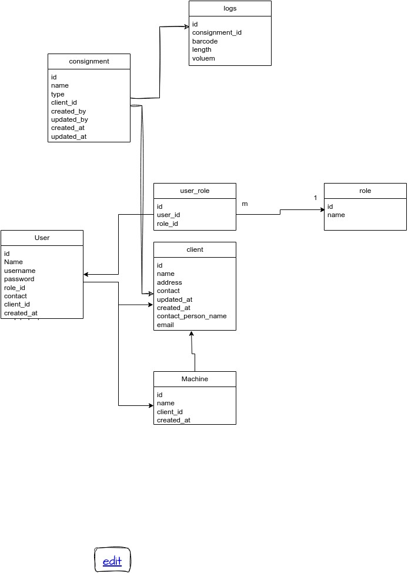

# web_dev_python
```
This is a web application developed using the Django framework. I have used the MySQL database. I have explained all the routes. To handle requests concurrently I have used the Gunicorn server. 
```
```
Client 
Our application operates on a subscription-based model, which means clients pay a periodic fee to access its features and services. One of the key features of our application is the ability for clients to create and manage multiple user accounts under a single subscription. This flexibility allows organizations and teams to efficiently use our application. The below section explains all Routes for the user

Create new Client
    URL: timba/client
    HTTP Method: put()
    Request Parameters:{
        "name", "address",
         "contact", 
         "email"
         }

    Response:{
        "Client created Successfully"
        }

```

```    
User
The below route help our client to manage their user, like seeing a list of user, adding new user, updating existing user, and deleting a user.

Description:Get information of a user by user_id.

    URL: timba/user
    HTTP Method: get()
        Request Parameters: {
            user_id
            }

        Response : {
            "Client created Successfully"
            }


    put(): create user. insert information of user in databases.

        Request Parameters:{
                "client_id":1,
                "name": "vikesh",
                "address": "delhi",
                "role": 1,  
                "username": "vk",
                "contact": " vikesh"
        }

        Response{    
            "message": "User created successfully",
            "data": {
                "id": 3,
                "name": "vikesh",
                "username": "vk",
                "role_id": 1,
                "contact": " vikesh",
                "client_id": 1,
                "created_at": "2023-10-08T12:38:27.453Z",
                "updated_at": "2023-10-08T12:38:27.453Z"
            }
        }

    patch() :update user information by user_ id.
        Request Parameter: {
                "id":2,
                "name": "vikash",
                "address": "noida",
                "role": 1,  
                "username": "vk1",
                "contact": " vikesh"    
            }
        
        Response: {
                "message": "User updated successfully"
            }

    delete() : delete user from the database by user_id.
        Request parameter:{
                "id":2 
            }

        Response: {
        "message": "User deleted successfully
        }
```
```    
Users:- Bellow rote help our client to fetch information of their all users

URL: timbba/usres
HTTP Method: 
    get(): get all users of a client
        Request Parameters: {clilent_id}

        Response : list of user information in JSON form.
```
    
```    
Role:- Each user will have one or more then  role in our application. For example a user can access an application using mobile only, another user can access using the web only and someone will have access to both. Some features in the mobile app are not available in the web app and vice versa.

Bellow route helps our client to Create a new role.
    URL: timbba/role
    HTTP Method: 
        put(): Create a role
            Request Parameters: {rolename}

        Response: Simple message in jsonform if successfully created or Error.
```

```
Log:- Each consignment will have a list of logs. We can fetch or put one log at a time in the database of a particular consignment.

Bellow route helps our client to insert and fetch the log of a consignment.

    URL: timbba/log<br>
    HTTP Method:<br>
        put(): insert information of a log in database
        Request Parameters: {
                length,breadth,
                height,consignment_id,
                client_id
                }
        Response: {
            "Successfully inserted"
            }

        get() : get information of a log.<br>
        Request Parameters: {
            consignment_id,
            client_id
            }
```    
```
Logs:  To fetch information of all logs of consignment
    URL: timbba/logs
    HTTP Methods:
        get(): get all logs of a particular consignment by consignment_id.<br>
            Request Parameters: {
                    consignment_id
                    }
            Response : information of a consignment with all logs information in json form

```

Consignment: Insert information of new consignment, fetch information of existing consignment 

    URL: timbba/consignment
    HTTP Methods:
        put(): create a consignment .insert information of a consignment of a client .it store client_id because each consignment belongs to a client. It also stores user_id by which this consignment is created.
            Request Parameters: {
                user_id,
                client_id,
                name,
                type
            }
            Response : Json response with text message either success or error

        get(): get information of a consignment by consignment_id.
            Request Parameters: {
                user_id,
                client_id,
                name,
                type
            }
             Response :   
                "consignment": {
                    "id": 1,
                    "name": "cons11",
                    "type": "0",
                    "client_id": 2,
                    "created_by": 2,
                    "updated_by": 2,
                    "created_at": "2023-10-07T12:15:14.713Z",
                    "updated_at": "2023-10-07T12:15:14.714Z"
                }
    
```    
Consignments
    URL: timbba/consignment
    HTTP Methods:
        get() :get all consignments of a particular client by client_id 
            Request Parameters: {
                    client_id
                }

            Response :   "consignments": [
                    {
                    "id": 1,
                    "name": "cons11",
                    "type": "0",
                    "client_id": 2,
                    "created_by": 2,
                    "updated_by": 2,
                    "created_at": "2023-10-07T12:15:14.713Z",
                    "updated_at": "2023-10-07T12:15:14.714Z"
                    }
                ]
```

```
django: I used the VIEW class of django which provides features to create a view including request ,response handling and error handling.Sql database is used to store the data.ORM feature is used to design the database schema. Defined a model Django models are Python classes that represent database tables. Each model class corresponds to a table, and the class attributes define the table's fields.
```
```
Tool

Docker: I have used two services: backend_service and mysql_service. backend_serivce containerizes my web application and mysl_service containerizes MySQL database.

```
```
Gunicorn: I have used gunicorn in this project to handle multiple HTTP request at a same time.Gunicorn's worker process model is a way to handle multiple requests concurrently. Each worker process can handle multiple requests at a time.all of the worker processes are created before the application starts, and they remain running until the application is stopped.When a request comes in, Gunicorn assigns it to a worker process, The worker process then handles the request and returns the response. Once the request is complete, the worker process is ready to handle another request.Gunicorn can handle multiple requests concurrently because it uses a non-blocking I/O model. This means that the worker process does not wait for a request to complete before it starts handling the next request. Instead, the worker process will handle multiple requests at the same time, switching between them as needed.if a worker process gets down a new process will be created and all the old HTTP request will be sift to new process.
```

Database Design


Class Diagram :
